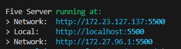
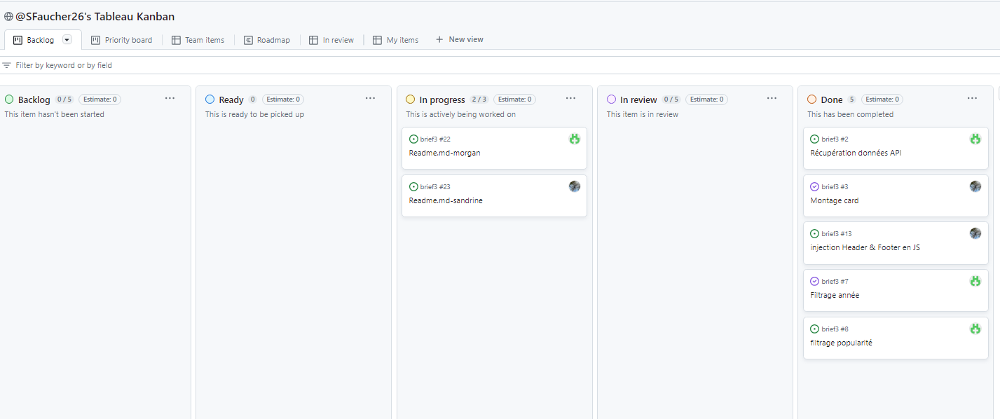
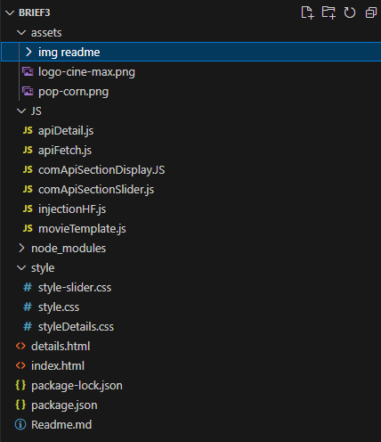
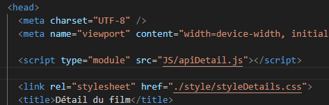
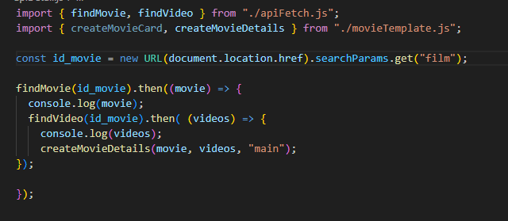
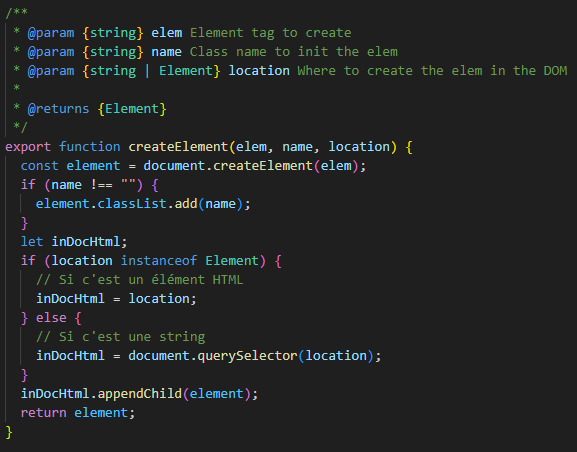
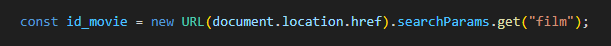
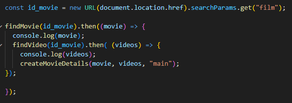
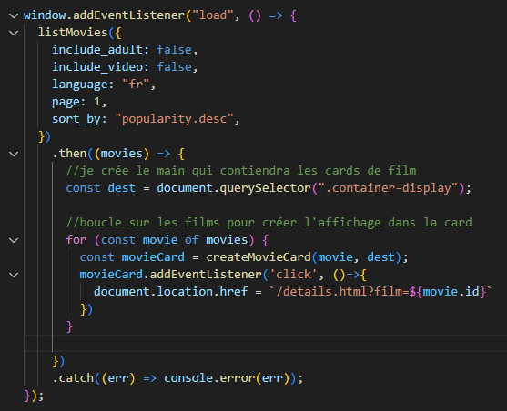

# Projet Brief3 : Affichage de films #
Réalisation d'une page web qui affiche des films récupérés à l'aide de l'API The Movie Data Base.

### Langages utilisés ###
HTML, CSS, JAVASCRIPT

### Démarer le projet ###
- sur la page index.html dans vscode, cliquer sur Golive en bas à droite (disponible grace à l'extension live serveur).
- le projet s'affiche sur un port url :



### Méthode de travail ###
Projet développé en Agile à l'aide d'un tableau kanban avec création d'issues



### Structure des pages ###



En ajoutant un attribut type="module" dans la balise "script" des fichiers.html avec lesquels il interagit, celui-ci 
peut être importé dans un autre fichier.js afin de rendre ses fonctions disponibles

Exemple sur les captures suivantes :





### Fetch API ###
Ce fichier.js permet de réaliser les appels API

Cf workflow

### Création des cards pour affichage ###

Création de nos cards à l'aide d'une fonction 



### Création du slider avec filtrage en fetch API ###

 
 ** Listes des tâches correspondantes **

[x] [Issue #2: Recuperation données API](https://github.com/SFaucher26/brief3/issues/2)

[x] [Issue #7 : Filtrage](https://github.com/SFaucher26/brief3/issues/7)

[x] [Issue #8 : Filtrage](https://github.com/SFaucher26/brief3/issues/8)


**1- Création et initialisation du slider**

Slider contenu dans le fichier: "JS\comApiSectionSlider.js" sur une base de card mise à jour par un fetch d'initialisation selon le endpoint :
            'https://api.themoviedb.org/3/discover/movie'
Avec option de base par défaut (rangement par popularity desc.)

<!--  -->
```js
window.addEventListener("load", async () => {
  inputBtnNext = document.querySelector(".input-next");
  inputBtnPrev = document.querySelector(".input-prev");
  imgSlider = document.querySelector(".img-slider");
  titleSlider = document.querySelector(".slider-title");
  // checkboxes = document.querySelectorAll(".checkbox");
  movies = await fetchData(queryParams);
  addListeners();
  indexFilm = 0; // initialisation indexFilm pour le slider
  checkboxes[1].checked = true;
});
```

**2- Mise en place du filtrage sur ce slider**

Mise en place sur une base HTML,CSS et JS et via trois options gérées par boutons radio: "now playing", "popularity", "année de sortie"
D'autres peuvent être ajoutés selon le besoin ou bien les existants peuvent être aisément modifiés grâce à la modularité du code associé.


**3- Code associé**
La page html s'appuie sur 3 scripts qui servent le projet global selon les sections:

```html
<head>
    <meta charset="UTF-8">
    <meta name="viewport" content="width=device-width, initial-scale=1.0">
    <script defer type="module" src="./JS/comApiSectionDisplay.JS"></script>
    <script defer type="module" src="./JS/comApiSectionSlider.js"></script>
    <script defer type ="module" src="./JS/injectionHF.js"></script>
    
    <link rel="stylesheet" href="./style/style.css">
    <link rel="stylesheet" href="./style/style-slider.css">
    <title>Ciné-max</title>
</head>
```
<!-- => -->

Concernant le slider, il s'agit de JS\comApiSectionSlider.js qui s'appuie sur un import de fonction (listMovies) de JS\apiFetch.js concernant les requête API de filtrage.

### Page détail ###

Pour réaliser la page d'accueil :
- création d'une nouvelle page details.html
- Récupération de l'id du film avec la synthaxe :



- passae de la variable id_movie dans les fonctions fetch

Exemple :



- code de l'écoute d'évènement au clic sur la card :

Pour chaque film récupéré on affiche une card 
et au clic sur celle-ci le film s'affiche dans la page détail



